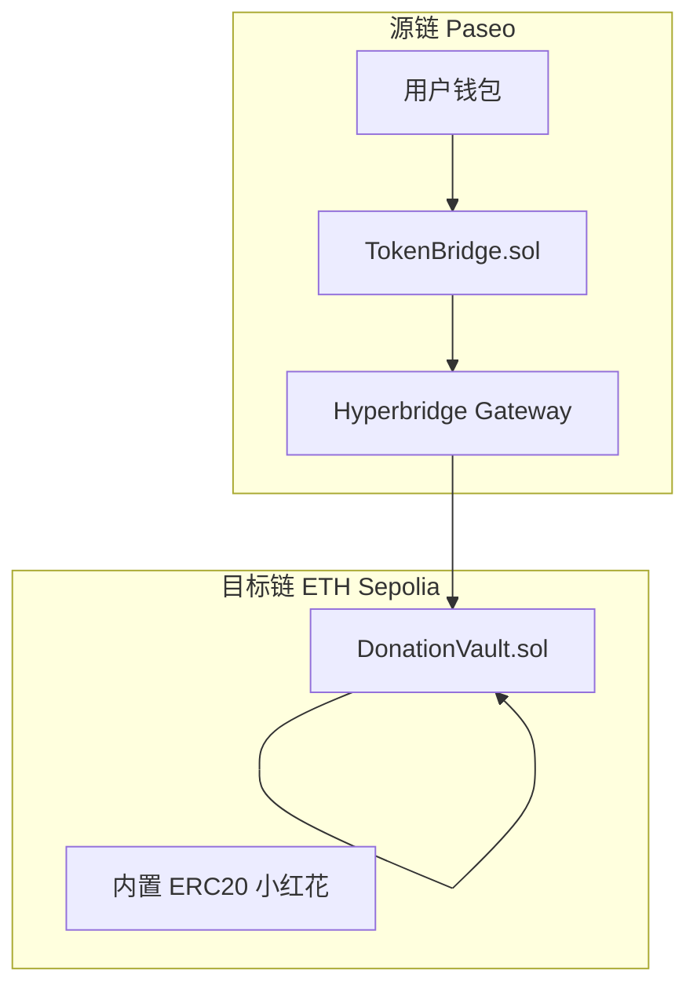
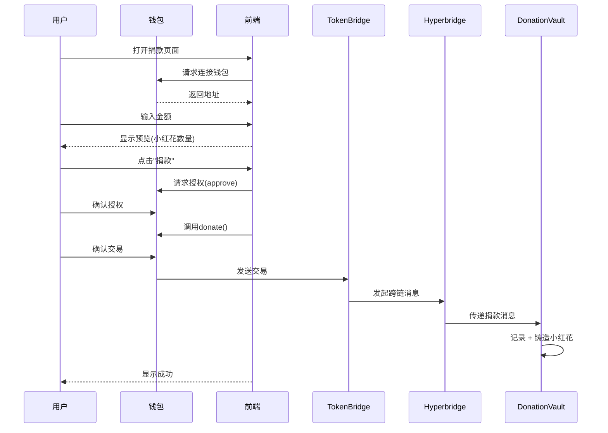

# 🌸 送你一朵小红花 - MVP 开发文档

> **开发时间**：1.5天 | **团队**：1前端 + 1合约工程师

---

## 一、MVP 核心功能列表

### 1.1 智能合约层

| 功能 | 说明 | 优先级 |
|------|------|--------|
| ✅ **TokenBridge 跨链入口** | 源链接收捐款并发起跨链 | P0 |
| ✅ **DonationVault 金库** | 目标链接收资金并管理 | P0 |
| ✅ **小红花 ERC20 铸造** | 捐款后自动发放代币 | P0 |
| ✅ **预设事件** | 合约内置一个救助事件 | P0 |
| ✅ **捐款记录查询** | 查询地址捐款历史 | P1 |
| ✅ **事件进度查询** | 查询筹款进度 | P1 |
| ✅ **管理员提款** | 截止后管理员可提取 | P1 |
| ❌ ~~多签提款~~ | 3/5 多签 | 叙事 |
| ❌ ~~时间锁~~ | 24h 冷却期 | 叙事 |

### 1.2 前端层

| 页面 | 功能点 | 优先级 |
|------|--------|--------|
| ✅ **首页** | 项目介绍、当前事件展示、快速捐款入口 | P0 |
| ✅ **捐款页** | 选择链、输入金额、预览小红花、确认捐款 | P0 |
| ✅ **我的记录** | 捐款历史、小红花余额、代币地址 | P1 |
| ❌ ~~事件创建页~~ | 管理员创建事件 | 叙事 |

### 1.3 基础设施

| 模块 | 说明 | 状态 |
|------|------|------|
| ✅ **钱包连接** | MetaMask 连接 | 必须 |
| ✅ **网络切换** | 自动提示切换到源链 | 必须 |
| ✅ **交易状态** | 显示交易进度 | 必须 |
| ❌ ~~IPFS 上传~~ | 证明材料上传 | 叙事 |

---

## 二、技术栈

| 层级 | 技术选型 |
|------|---------|
| **合约开发** | Solidity + Foundry |
| **跨链协议** | Hyperbridge SDK |
| **前端框架** | React + Vite + TypeScript |
| **Web3库** | wagmi + viem |
| **钱包连接** | RainbowKit / 直接 MetaMask |
| **UI框架** | TailwindCSS |

---

## 三、合约架构

### 3.1 合约清单

| 合约 | 部署链 | 作用 |
|------|--------|------|
| `TokenBridge.sol` | 源链 (Paseo) | 跨链捐款入口 |
| `DonationVault.sol` | 目标链 (ETH Sepolia) | 金库 + 内置小红花 ERC20 |

---

### 3.2 TokenBridge.sol 功能清单

| 类型 | 名称 | 功能 | 可见性 |
|------|------|------|--------|
| **构造函数** | `constructor(gateway, vault, destChainId)` | 初始化跨链网关、目标金库地址 | - |
| **写函数** | `donate(token, amount)` | 接收用户代币，发起跨链消息 | external payable |

**状态变量**：

| 变量 | 类型 | 说明 |
|------|------|------|
| `tokenGateway` | ITokenGateway | Hyperbridge 网关地址 |
| `donationVault` | address | 目标链金库地址 |
| `destChainId` | bytes | 目标链标识 |

**事件**：`DonationInitiated(donor, amount, messageId)`

---

### 3.3 DonationVault.sol 功能清单

| 类型 | 名称 | 功能 | 可见性 |
|------|------|------|--------|
| **构造函数** | `constructor()` | 初始化 ERC20 小红花代币 | - |
| **写函数** | `createEvent(title, desc, target, deadline, beneficiary)` | 创建捐助事件 | external onlyOwner |
| **写函数** | `receiveDonation(eventId, donor, amount)` | 接收跨链捐款 + 铸造小红花 | external |
| **写函数** | `withdraw(eventId)` | 管理员提取资金 | external onlyOwner |
| **读函数** | `getEventDonations(eventId)` | 获取事件所有捐款记录 | view |
| **读函数** | `getDonorFlowers(donor)` | 获取用户小红花余额 | view |
| **读函数** | `events(eventId)` | 获取事件信息 | view (自动生成) |
| **读函数** | `donorTotalAmount(donor)` | 获取用户累计捐款 | view (自动生成) |

**继承的 ERC20 函数**：

| 函数 | 功能 |
|------|------|
| `balanceOf(address)` | 查询小红花余额 |
| `totalSupply()` | 查询小红花总量 |
| `transfer(to, amount)` | 转账小红花 |
| `name()` / `symbol()` | 代币名称/符号 |

**状态变量**：

| 变量 | 类型 | 说明 |
|------|------|------|
| `FLOWER_RATIO` | uint256 (常量=100) | 1 USDT = 100 小红花 |
| `eventCount` | uint256 | 事件数量 |
| `events` | mapping | 事件映射 |
| `eventDonations` | mapping | 事件捐款记录 |
| `donorTotalAmount` | mapping | 用户累计捐款 |

**事件**：
- `EventCreated(eventId, title, targetAmount)`
- `DonationReceived(eventId, donor, amount, flowers)`
- `FundsWithdrawn(eventId, beneficiary, amount)`

---

### 3.4 架构图



### 3.5 TokenBridge.sol（源链 - Paseo）

```solidity
// SPDX-License-Identifier: MIT
pragma solidity ^0.8.17;

import {ITokenGateway, TeleportParams} from "@hyperbridge/core/apps/TokenGateway.sol";
import {IERC20} from "@openzeppelin/contracts/token/ERC20/IERC20.sol";

contract TokenBridge {
    ITokenGateway public immutable tokenGateway;
    address public donationVault;        // 目标链金库地址
    bytes public destChainId;            // 目标链标识
    
    event DonationInitiated(
        address indexed donor,
        uint256 amount,
        bytes32 messageId
    );
    
    constructor(
        address _tokenGateway,
        address _donationVault,
        bytes memory _destChainId
    ) {
        tokenGateway = ITokenGateway(_tokenGateway);
        donationVault = _donationVault;
        destChainId = _destChainId;
    }
    
    /// @notice 发起跨链捐款
    function donate(address token, uint256 amount) external payable {
        require(amount > 0, "Amount must be positive");
        
        IERC20(token).transferFrom(msg.sender, address(this), amount);
        IERC20(token).approve(address(tokenGateway), amount);
        
        bytes memory payload = abi.encode(msg.sender, amount);
        
        // TODO: 调用 Hyperbridge 跨链
        // bytes32 messageId = tokenGateway.teleport(...);
        
        emit DonationInitiated(msg.sender, amount, bytes32(0));
    }
}
```

### 3.6 DonationVault.sol（目标链 - ETH Sepolia，内置 ERC20）

```solidity
// SPDX-License-Identifier: MIT
pragma solidity ^0.8.17;

import {ERC20} from "@openzeppelin/contracts/token/ERC20/ERC20.sol";
import {Ownable} from "@openzeppelin/contracts/access/Ownable.sol";
import {ReentrancyGuard} from "@openzeppelin/contracts/security/ReentrancyGuard.sol";

contract DonationVault is ERC20, Ownable, ReentrancyGuard {
    
    uint256 public constant FLOWER_RATIO = 100; // 1 USDT = 100 小红花
    
    struct DonationEvent {
        string title;
        string description;
        uint256 targetAmount;
        uint256 currentAmount;
        uint256 deadline;
        address beneficiary;
        bool isActive;
    }
    
    struct Donation {
        address donor;
        uint256 amount;
        uint256 timestamp;
        uint256 flowersReceived;
    }
    
    uint256 public eventCount;
    mapping(uint256 => DonationEvent) public events;
    mapping(uint256 => Donation[]) public eventDonations;
    mapping(address => uint256) public donorTotalAmount;
    
    event EventCreated(uint256 indexed eventId, string title, uint256 targetAmount);
    event DonationReceived(uint256 indexed eventId, address indexed donor, uint256 amount, uint256 flowers);
    event FundsWithdrawn(uint256 indexed eventId, address indexed beneficiary, uint256 amount);
    
    constructor() ERC20("RedFlower", "FLOWER") Ownable(msg.sender) {}
    
    /// @notice 创建捐助事件
    function createEvent(
        string calldata title,
        string calldata description,
        uint256 targetAmount,
        uint256 deadline,
        address beneficiary
    ) external onlyOwner returns (uint256 eventId) {
        require(deadline > block.timestamp, "Invalid deadline");
        require(targetAmount > 0, "Invalid target");
        
        eventId = ++eventCount;
        events[eventId] = DonationEvent({
            title: title,
            description: description,
            targetAmount: targetAmount,
            currentAmount: 0,
            deadline: deadline,
            beneficiary: beneficiary,
            isActive: true
        });
        
        emit EventCreated(eventId, title, targetAmount);
    }
    
    /// @notice 接收跨链捐款（由 Hyperbridge 调用）
    function receiveDonation(
        uint256 eventId,
        address donor,
        uint256 amount
    ) external nonReentrant {
        // TODO: 验证调用者是 Hyperbridge Handler
        
        DonationEvent storage evt = events[eventId];
        require(evt.isActive, "Event not active");
        require(block.timestamp < evt.deadline, "Event ended");
        
        evt.currentAmount += amount;
        donorTotalAmount[donor] += amount;
        
        uint256 flowers = amount * FLOWER_RATIO;
        _mint(donor, flowers);
        
        eventDonations[eventId].push(Donation({
            donor: donor,
            amount: amount,
            timestamp: block.timestamp,
            flowersReceived: flowers
        }));
        
        emit DonationReceived(eventId, donor, amount, flowers);
    }
    
    /// @notice 管理员提取资金
    function withdraw(uint256 eventId) external onlyOwner nonReentrant {
        DonationEvent storage evt = events[eventId];
        require(block.timestamp >= evt.deadline, "Event not ended");
        
        uint256 amount = evt.currentAmount;
        evt.currentAmount = 0;
        evt.isActive = false;
        
        // TODO: 转账给受助方
        // IERC20(token).transfer(evt.beneficiary, amount);
        
        emit FundsWithdrawn(eventId, evt.beneficiary, amount);
    }
    
    /// @notice 查询事件捐款记录
    function getEventDonations(uint256 eventId) external view returns (Donation[] memory) {
        return eventDonations[eventId];
    }
    
    /// @notice 查询用户小红花余额
    function getDonorFlowers(address donor) external view returns (uint256) {
        return balanceOf(donor);
    }
}
```

---

## 四、业务流程

### 4.1 用户捐款完整流程



### 4.2 简化用户流程

```
1️⃣ 连接钱包 → 2️⃣ 输入金额 → 3️⃣ 确认交易 → 🌸 获得小红花
```

---

## 五、前端页面设计

### 5.1 首页布局

```
┌─────────────────────────────────────────────────────────────┐
│  🌸 送你一朵小红花                    [连接钱包]           │
├─────────────────────────────────────────────────────────────┤
│                                                             │
│  ┌─────────────────────────────────────────────────────┐   │
│  │  当前救助事件：某某小朋友需要医疗救助                    │   │
│  │  ━━━━━━━━━━━━━━━━━━━━━━━━━━━━━ 67%                   │   │
│  │  已筹：$6,700 / 目标：$10,000                         │   │
│  │  截止日期：2026-01-15                                 │   │
│  │                                                       │   │
│  │  [💝 立即捐款]                                         │   │
│  └─────────────────────────────────────────────────────┘   │
│                                                             │
│  📊 平台数据                                                │
│  ┌──────────┬──────────┬──────────┐                        │
│  │ 总捐款额  │ 捐赠人数  │ 小红花数  │                        │
│  │ $12,500  │   156    │ 1,250,000│                        │
│  └──────────┴──────────┴──────────┘                        │
│                                                             │
└─────────────────────────────────────────────────────────────┘
```

### 5.2 捐款页布局

```
┌─────────────────────────────────────────────────────────────┐
│  ← 返回             发起捐款                                 │
├─────────────────────────────────────────────────────────────┤
│                                                             │
│  📍 源链选择                                                │
│  ┌─────────────────────────────────────────────────────┐   │
│  │  [●] Sepolia Testnet    [ ] BSC Testnet             │   │
│  └─────────────────────────────────────────────────────┘   │
│                                                             │
│  💰 捐款金额                                                │
│  ┌─────────────────────────────────────────────────────┐   │
│  │  [______________100______________] USDT             │   │
│  └─────────────────────────────────────────────────────┘   │
│                                                             │
│  🌸 您将获得                                                │
│  ┌─────────────────────────────────────────────────────┐   │
│  │            10,000 小红花                             │   │
│  │        (1 USDT = 100 小红花)                         │   │
│  └─────────────────────────────────────────────────────┘   │
│                                                             │
│  ┌─────────────────────────────────────────────────────┐   │
│  │               [ 💝 确认捐款 ]                         │   │
│  └─────────────────────────────────────────────────────┘   │
│                                                             │
└─────────────────────────────────────────────────────────────┘
```

---

## 六、技术实现对照表

| 功能 | 合约函数 | 前端调用 |
|------|---------|---------|
| 发起捐款 | `TokenBridge.donate(token, amount)` | `useContractWrite` |
| 接收捐款 | `DonationVault.receiveDonation()` | Hyperbridge 回调 |
| 查询余额 | `DonationVault.balanceOf(addr)` | `useContractRead` |
| 查询事件 | `DonationVault.events(eventId)` | `useContractRead` |
| 查询记录 | `DonationVault.getEventDonations(id)` | `useContractRead` |

---

## 七、项目目录结构

```
Send_a_Little_Red_Flower/
├── contracts/                    # Foundry 项目
│   ├── src/
│   │   ├── TokenBridge.sol       # 跨链入口（源链）
│   │   └── DonationVault.sol     # 捐款金库 + 小红花（目标链）
│   ├── test/
│   │   └── DonationVault.t.sol
│   ├── script/
│   │   └── Deploy.s.sol
│   ├── foundry.toml
│   └── remappings.txt
├── frontend/                     # React + Vite + wagmi
│   ├── src/
│   │   ├── pages/
│   │   │   ├── Home.tsx          # 首页
│   │   │   ├── Donate.tsx        # 捐款页
│   │   │   └── MyRecords.tsx     # 我的记录
│   │   ├── components/
│   │   │   ├── Header.tsx
│   │   │   ├── EventCard.tsx
│   │   │   └── DonationForm.tsx
│   │   ├── hooks/
│   │   │   └── useContracts.ts
│   │   └── config/
│   │       └── contracts.ts
│   └── package.json
├── docs/
│   ├── NARRATIVE_AND_DESIGN.md   # 叙事+完整设计
│   └── MVP.md                    # 本文档
└── README.md
```

---

## 八、开发时间线（1.5天）

### Day 1 上午（4小时）- 基础搭建

| 时间 | 前端工程师 | 合约工程师 |
|------|-----------|-----------|
| 09:00-11:00 | 项目初始化、钱包连接 | Foundry 环境 + Hyperbridge SDK |
| 11:00-13:00 | 基础 UI 框架搭建 | DonationVault.sol 核心逻辑 |

### Day 1 下午（4小时）- 核心功能

| 时间 | 前端工程师 | 合约工程师 |
|------|-----------|-----------|
| 14:00-16:00 | 首页 + 事件展示 | TokenBridge.sol 编写 |
| 16:00-18:00 | 捐款页面开发 | 合约单元测试 |

### Day 1 晚上（3小时）- 集成联调

| 时间 | 两人协作 |
|------|---------|
| 19:00-22:00 | 前后端联调、部署到测试网 |

### Day 2 上午（4小时）- 优化完善

| 时间 | 前端工程师 | 合约工程师 |
|------|-----------|-----------|
| 09:00-11:00 | UI 美化、交互优化 | 跨链测试、问题修复 |
| 11:00-13:00 | 我的记录页面 | 文档编写 |

### Day 2 下午（3小时）- 收尾提交

| 时间 | 两人协作 |
|------|---------|
| 14:00-17:00 | 端到端测试、录制演示视频、提交作品 |

---

## 九、Demo 演示步骤（2分钟）

| 步骤 | 操作 | 展示效果 | 时长 |
|------|------|---------|------|
| 1 | 打开首页 | 展示项目介绍和当前事件 | 10s |
| 2 | 点击"连接钱包" | MetaMask 弹窗确认 | 10s |
| 3 | 点击"我要捐款" | 进入捐款页 | 5s |
| 4 | 输入金额 "100" | 显示将获得 10000 小红花 | 10s |
| 5 | 点击"确认捐款" | 弹出 Approve + 交易确认 | 20s |
| 6 | 等待交易确认 | 显示"跨链传输中..." | 30s |
| 7 | 交易成功 | 🎉 弹出成功动画 | 10s |
| 8 | 点击"我的记录" | 展示捐款历史和小红花余额 | 15s |
| 9 | 打开区块浏览器 | 展示链上交易记录 | 10s |

---

## 十、MVP vs 完整版对照

| 功能模块 | MVP（1.5天） | 完整版（未来） |
|---------|-------------|---------------|
| 合约架构 | 2合约 | 模块化可升级 |
| 事件审核 | 管理员手动 | 多级审核+公示 |
| 资金监管 | 单一管理员 | 3/5多签+时间锁 |
| KYC/AML | 无 | 分层KYC |
| 退款机制 | 手动处理 | 自动退款 |
| 隐私保护 | 公开透明 | ZK可选匿名 |
| 审计 | Slither扫描 | 专业审计报告 |
| 前端页面 | 3页 | 完整管理后台 |
| 链支持 | Sepolia→Paseo | 多链支持 |

---

## 十一、验证清单

### 合约测试

```bash
cd contracts
forge test -vvv
```

### 前端构建

```bash
cd frontend
npm run build
```

### 端到端测试

- [ ] 钱包连接正常
- [ ] 首页事件显示正确
- [ ] 捐款金额输入正常
- [ ] 小红花数量计算正确
- [ ] 交易发起成功
- [ ] 跨链消息传递成功
- [ ] 小红花余额更新正确
- [ ] 捐款记录显示正确
