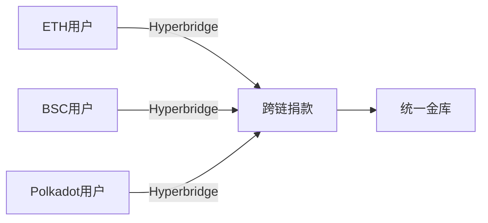
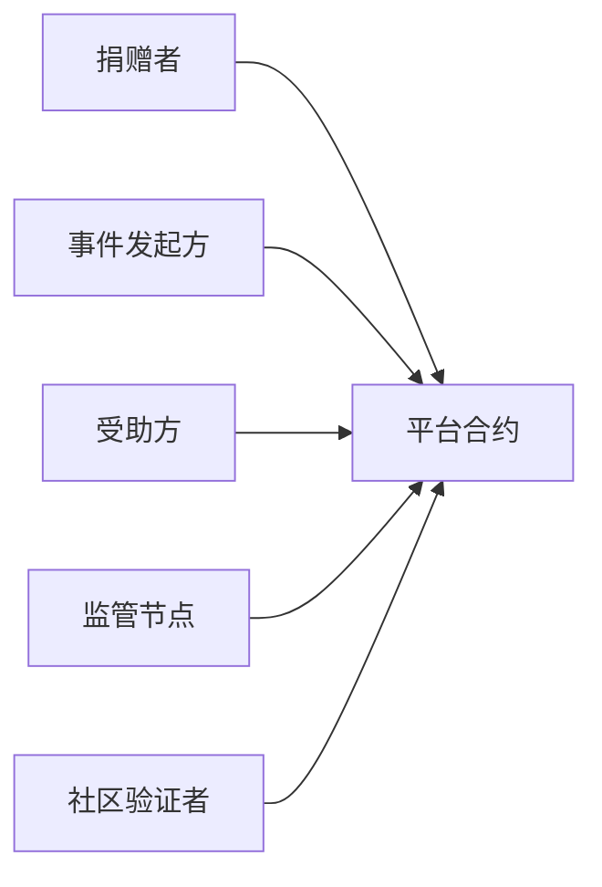
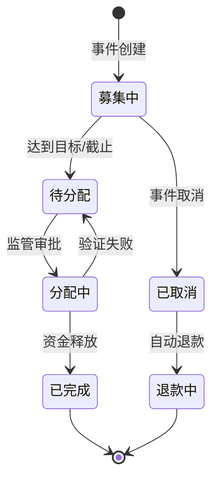
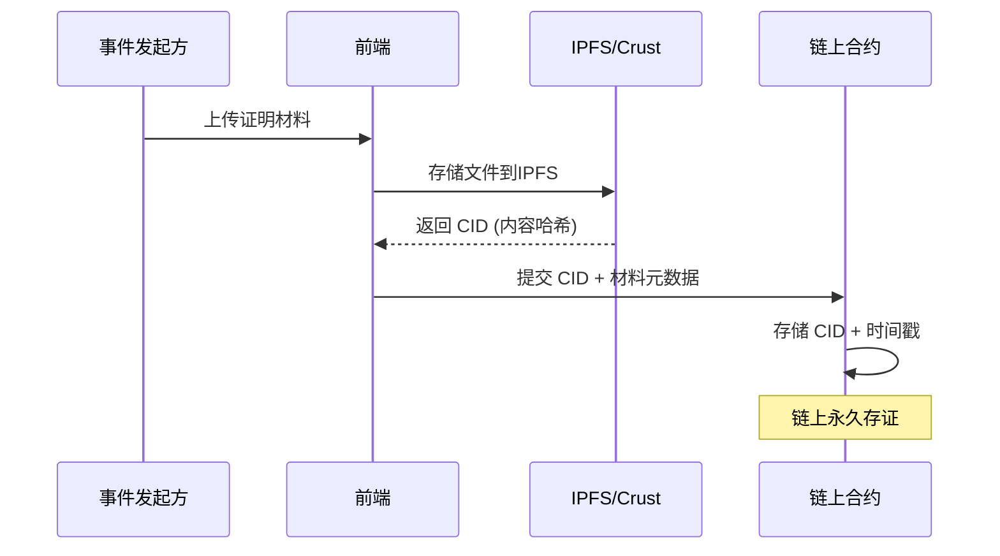
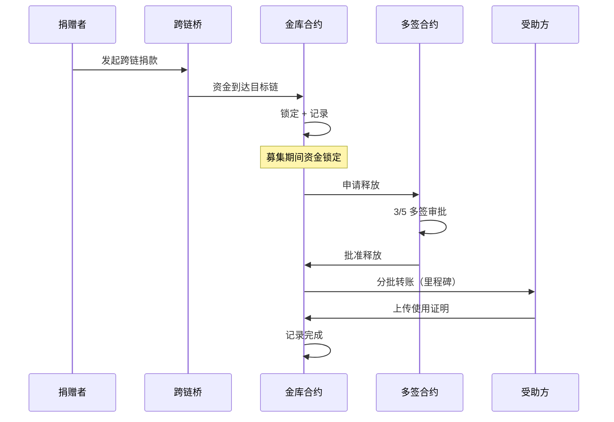
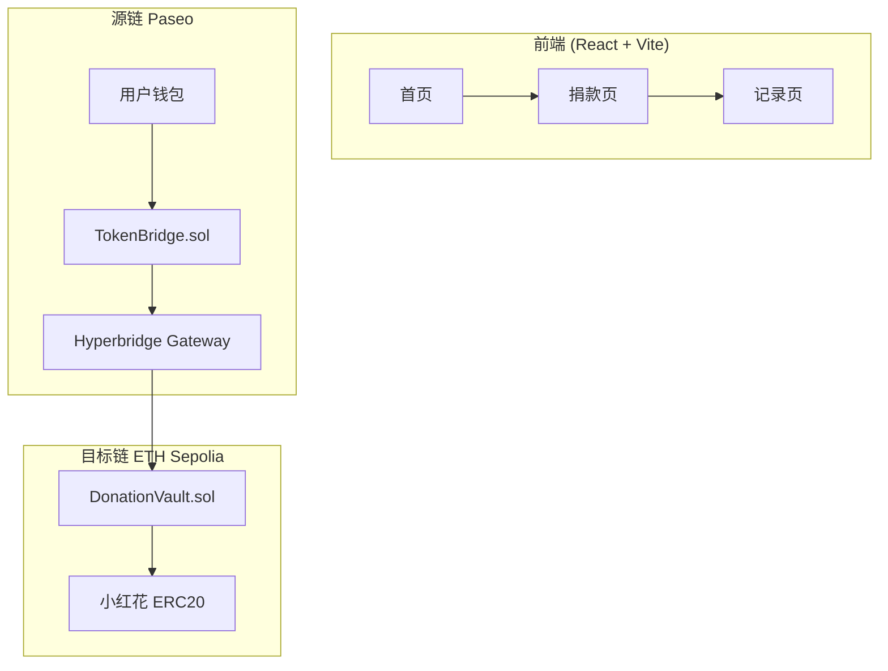

# 🌸 送你一朵小红花 - 项目叙事与完整设计

> **Polkadot Codecamp Hackathon - XCM + Hyperbridge Challenge**

---

## 项目愿景

> **"让爱心跨越链的边界，让善款流向透明如水"**

基于 Polkadot 跨链生态，构建一个**去中心化、透明、隐私保护**的慈善捐助平台。

---

## 项目名称寓意 🌸

**"送你一朵小红花"** 包含双重温暖的含义：

| 对象 | "你" 的含义 | "小红花" 的含义 |
|------|------------|----------------|
| **捐赠者** | 每一位献出爱心的你 | 精神褒奖 - 慈善行为的链上凭证和荣誉勋章 |
| **受助者** | 每一位需要帮助的你 | 经济援助 - 来自社会的温暖和支持 |

### 核心理念

> 🌸 **对捐赠者**：你的每一份善意都值得被铭记，小红花是你爱心的永恒证明
>
> 🌸 **对受助者**：无论你身在何处，社会的温暖都会跨越链的边界抵达你身边

---

## Part 1: 为什么选择 Polkadot × 跨链？

### 1.1 慈善的本质是无边界的

> **"苦难没有国界，爱心也不应有链的隔阂"**

传统互联网已经让信息无边界流动，但资金流动仍被法币体系、支付渠道、地域限制所割裂。而在 Web3 世界，**资金同样被不同的区块链所割裂**——你的 ETH 在以太坊，我的 DOT 在 Polkadot，他的 BNB 在 BSC。

**跨链慈善的意义**：让全球任何链上的善款，都能汇聚到需要帮助的人手中。

### 1.2 为什么是 Polkadot？

| 维度 | 为什么选择 Polkadot | 对慈善平台的价值 |
|------|-------------------|----------------|
| **原生跨链架构** | Polkadot 的 XCM 是区块链级别的标准跨链协议 | 不是"桥接"而是"原生互操作"，更安全 |
| **共享安全性** | 所有平行链共享中继链的安全验证 | 无需担心单链安全性不足 |
| **异构多链** | 支持不同共识、不同 VM 的链 | 可同时支持 EVM 链和 Substrate 链 |
| **生态丰富** | 50+ 平行链，覆盖 DeFi、NFT、存储等 | 可与 Crust(存储)、Moonbeam(EVM) 等无缝协作 |
| **低成本** | 交易费用远低于以太坊主网 | 小额捐款也不会被 Gas 费"吃掉" |

#### Polkadot vs 传统跨链桥

```
┌─────────────────────────────────────────────────────────────────┐
│                    传统跨链桥方案                                  │
│  ETH ──[桥A]──> Wrapped Token ──[桥B]──> BSC                    │
│  ⚠️ 桥被黑客攻击 = 资金损失（Ronin $6.25亿被盗）                    │
└─────────────────────────────────────────────────────────────────┘

┌─────────────────────────────────────────────────────────────────┐
│                    Polkadot 跨链方案                              │
│  Moonbeam ◄─────── XCM ───────► Asset Hub ◄───── XCM ────► Hydra │
│                      ▲                                          │
│                      │                                          │
│               中继链统一验证                                        │
│  ✅ 共享安全，无需信任第三方桥                                        │
└─────────────────────────────────────────────────────────────────┘
```

### 1.3 为什么是 Hyperbridge？

| 对比项 | 传统跨链桥 | Hyperbridge |
|--------|----------|-------------|
| **安全模型** | 信任桥运营商（中心化） | 密码学证明（去信任） |
| **攻击风险** | 桥合约漏洞/私钥泄露 | 需攻破共识层 |
| **消息类型** | 仅Token转移 | 任意跨链消息（Post/Get） |
| **确认时间** | 依赖多签/延迟 | 依赖区块最终性 |
| **生态覆盖** | 特定链对 | Polkadot生态 + EVM链 |

### 1.4 跨链捐赠的三大价值主张

#### 价值 1：打破资金孤岛



> "无论你在哪条链，只需一笔交易，你的善款就能跨越链的边界，直达受助者的金库。"

#### 价值 2：去信任的资金汇集

| 传统方案 | 我们的方案 |
|---------|-----------|
| 捐款 → 平台账户 → 平台决定怎么用 | 捐款 → 链上金库 → 智能合约自动执行 |
| 信任"平台是好人" | 信任"代码是透明的" |
| 事后报告（可能不公开） | 实时链上可查 |

#### 价值 3：全球化 × 本地化

> "慈善不应有国界。一个在美国使用以太坊的用户，可以直接向中国的贫困学生捐款，不需要经过任何中间机构。
>
> 这就是 Web3 + 跨链的力量：**让善意以光速传递**。"

---

## Part 2: 完整业务逻辑设计

### 2.1 核心问题与解决方案

| 传统慈善痛点 | 我们的解决方案 |
|-------------|---------------|
| 资金流向不透明 | 链上全程可追溯，智能合约自动执行 |
| 跨境捐款困难 | 跨链技术支持任意链直接捐款 |
| 中间商抽成 | 去中心化，100%到达受助方 |
| 隐私泄露风险 | ZK证明保护捐赠者隐私 |
| 信任成本高 | 不可篡改的链上记录 |

### 2.2 业务角色



| 角色 | 职责 | 权限 |
|------|------|------|
| **捐赠者** | 发起跨链捐款 | 选择事件、查看记录、获得小红花 |
| **事件发起方** | 发起救助事件 | 提交申请、上传证明材料 |
| **受助方** | 接收善款 | 提交使用证明 |
| **监管节点** | 审核事件真实性 | 审批事件、冻结可疑资金 |
| **社区验证者** | 验证资金使用 | 投票确认资金释放 |

### 2.3 资金生命周期（四阶段）



| 阶段 | 描述 | 资金状态 | 触发条件 |
|------|------|---------|---------|
| **募集中** | 接收捐款 | 锁定在合约 | 事件创建 |
| **待分配** | 等待验证 | 仍锁定 | 达到目标或截止日期 |
| **分配中** | 分批释放 | 按里程碑释放 | 监管审批通过 |
| **已完成** | 资金使用完毕 | 归零 | 所有里程碑完成 |

---

## Part 3: ZK 证明应用场景（完整愿景）

| 场景 | 问题 | ZK 解决方案 |
|------|------|------------|
| **捐赠者隐私** | 大额捐款可能暴露身份 | ZK证明捐款金额区间，不暴露具体数额 |
| **资质验证** | 受助方需证明困难资质 | ZK证明符合条件，不暴露详细信息 |
| **合规审计** | 需证明资金去向合规 | ZK证明资金用途合法，保护商业隐私 |
| **累计统计** | 证明总捐款达标 | ZK聚合证明，无需暴露个体数据 |

---

## Part 4: 证明材料上链技术栈

### 技术方案：IPFS + 链上哈希存证



### Polkadot 生态存储方案

| 方案 | 特点 | 适用性 |
|------|------|--------|
| **IPFS** | 内容寻址、去中心化分发 | ✅ 免费、易集成 |
| **Crust Network** | IPFS激励层、Polkadot平行链 | ⚡ 生态契合 |
| **Arweave** | 永久存储、一次付费 | 📋 长期存档 |

---

## Part 5: 资金流向监管机制

### 三层监管架构

```
┌─────────────────────────────────────────────────────────┐
│  第一层：智能合约自动化                                    │
│  - 时间锁：资金锁定至指定日期                              │
│  - 里程碑释放：分阶段释放资金                              │
│  - 自动退款：事件取消自动退还                              │
└─────────────────────────────────────────────────────────┘
┌─────────────────────────────────────────────────────────┐
│  第二层：多签监管                                          │
│  - 3/5 多签：监管节点审批大额转账                          │
│  - 紧急冻结：发现异常可暂停资金流动                         │
└─────────────────────────────────────────────────────────┘
┌─────────────────────────────────────────────────────────┐
│  第三层：社区验证                                          │
│  - DAO投票：社区投票确认资金使用                           │
│  - 信誉系统：累计验证记录，建立信任分                       │
└─────────────────────────────────────────────────────────┘
```

### 资金流向可视化



---

## Part 6: 评审员 Q&A 准备

### Q1: 如何保证救助事件的真实性？

> **A**: 我们设计了**三重验证机制**：
> 1. **事件发起审核**：需提交证明材料，由监管节点审核
> 2. **链上存证**：所有证明材料哈希上链，不可篡改
> 3. **社区监督**：任何人可举报虚假事件，触发复审

### Q2: 跨链捐款的安全性如何保证？

> **A**: 我们基于 **Hyperbridge** 协议：
> 1. **密码学证明**：所有跨链消息都经过密码学验证
> 2. **经济激励**：验证者需质押代币，作恶将被罚没
> 3. **最终性保证**：等待目标链最终确认后才释放资金

### Q3: 资金如果被恶意挪用怎么办？

> **A**: 多层防护：
> 1. **智能合约托管**：资金始终在链上，合约自动执行
> 2. **时间锁机制**：大额转账有冷却期，可紧急干预
> 3. **多签控制**：需要多个监管者共同批准
> 4. **保险基金**：预留部分资金用于风险补偿

### Q4: 小红花代币有什么实际价值？

> **A**: 小红花是**社会影响力凭证**：
> 1. **捐赠证明**：链上永久记录你的善举
> 2. **社区权益**：持有者可参与平台治理投票
> 3. **荣誉展示**：可在社交平台展示慈善贡献
> 4. **未来空投**：生态合作项目可能给予持有者福利

### Q5: 与传统捐款平台（如水滴筹）相比优势？

| 维度 | 传统平台 | 送你一朵小红花 |
|------|---------|---------------|
| 资金透明 | 事后报告 | 实时链上可查 |
| 跨境支付 | 复杂手续费高 | 跨链即时到账 |
| 中间费用 | 2-5% | 0%（仅gas） |
| 数据所有权 | 平台控制 | 用户完全拥有 |
| 信任模型 | 信任平台 | 信任代码 |

### Q6: 项目的商业模式是什么？

> **A**: **非营利 + 可持续**：
> 1. **零平台费**：捐款100%到达受助方
> 2. **Grants资助**：申请Web3生态基金支持
> 3. **企业合作**：为企业CSR提供链上证明服务
> 4. **增值服务**：定制化慈善解决方案

---

## Part 7: Demo 演示话术

### 开场白（30秒）
> "各位评审好，我是'送你一朵小红花'项目的负责人。
>
> 我们相信：**苦难没有国界，爱心也不应有链的隔阂**。
>
> 今天我要展示的，是一个基于 Polkadot 跨链生态的去中心化慈善平台。无论你在以太坊、BSC还是Polkadot，都可以一键捐款，参与全球公益。"

### 为什么 Polkadot（1分钟）
> "您可能会问：为什么选择 Polkadot，而不是以太坊或其他链？
>
> 第一，**原生跨链能力**。XCM 是 Polkadot 的核心设计，不是后加的补丁。这意味着跨链不再是'高风险桥接'，而是'原生互操作'。
>
> 第二，**共享安全**。所有平行链都由中继链的验证者保护，我们不需要担心某一条链被攻破。
>
> 第三，**生态协同**。我们可以与 Crust 合作存储证明材料，与 Moonbeam 兼容 EVM 用户，与 Hydra 对接流动性——这些都是 Polkadot 生态独有的优势。
>
> 最后，**低成本**。在以太坊上一笔捐款可能要花10美元Gas费，但在 Polkadot 生态只需要几分钱，这对小额慈善至关重要。"

### 跨链价值（30秒）
> "想象一下：一个地震发生在土耳其，全球的爱心人士想要捐款。
>
> 美国的用户持有 ETH，新加坡的用户持有 USDC，日本的用户在 Polkadot 生态。
>
> 传统平台需要他们分别换成法币，通过各自的银行系统转账，中间可能损失5-10%的手续费，还需要等待3-5个工作日。
>
> 而在我们的平台，他们只需要在自己熟悉的链上，一键发起跨链捐款。几分钟后，善款就会汇集到统一的链上金库，全程透明可追溯。
>
> **这就是我们选择跨链的原因：让全球善意无障碍流动。**"

---

## Part 8: 技术架构图

### 整体架构



### 合约架构（2合约）

| 合约 | 部署链 | 功能 |
|------|--------|------|
| `TokenBridge.sol` | 源链 (Paseo) | 跨链捐款入口 |
| `DonationVault.sol` | 目标链 (ETH Sepolia) | 金库 + 内置小红花 ERC20 |

---

## Part 9: 未来路线图

| 阶段 | 时间 | 目标 |
|------|------|------|
| **MVP** | 黑客松期间 | 跨链捐款演示 + 小红花发放 |
| **V1.0** | +1个月 | 多链支持 + 事件创建 |
| **V2.0** | +3个月 | ZK隐私 + 多签监管 |
| **V3.0** | +6个月 | DAO治理 + 生态合作 |

---

## Part 10: 平台定位与竞品分析 🎯

### 10.1 我们的平台定位

我们提供**众筹/捐款基础设施平台**，而非直接运营公益项目：

| 角色 | 说明 |
|------|------|
| **我们** | 提供平台技术基础设施、智能合约、跨链能力 |
| **机构用户** | 公益组织、慈善机构、NGO 在平台发起项目 |
| **捐赠者** | 全球用户通过平台向项目捐款 |

```
┌─────────────────────────────────────────────────────────────────┐
│                    平台模式定位                                   │
│                                                                 │
│  ┌──────────┐     ┌──────────────┐     ┌──────────────┐        │
│  │ 公益组织A │     │              │     │   捐赠者1    │        │
│  └────┬─────┘     │   送你一朵    │     └──────┬───────┘        │
│       │           │   小红花平台   │            │               │
│  ┌────┴─────┐     │              │     ┌──────┴───────┐        │
│  │ 公益组织B │ ──► │  (基础设施)   │ ◄── │   捐赠者2    │        │
│  └────┬─────┘     │              │     └──────┬───────┘        │
│       │           │              │            │               │
│  ┌────┴─────┐     └──────────────┘     ┌──────┴───────┐        │
│  │ 公益组织C │                          │   捐赠者3    │        │
│  └──────────┘                          └──────────────┘        │
└─────────────────────────────────────────────────────────────────┘
```

### 10.2 链上竞品分析

#### 🏆 主要竞品一览

| 平台 | 定位 | 商业模式 | 年收入 | 代币 | 特点 |
|------|------|----------|--------|------|------|
| **The Giving Block** | 加密捐赠基础设施 | B2B服务费 | ~$7.4M | ❌ | 最成功案例 |
| **Gitcoin** | 公共物品资助 | 协议费 | ~$2.3M | GTC | 二次方资助 |
| **Giveth** | 零费用众筹 | 探索中 | N/A | GIV | 代币激励 |
| **BitGive** | 501(c)(3)非营利 | 捐赠驱动 | N/A | ❌ | 透明追踪 |
| **Alice.si** | 结果导向型慈善 | 结果付费 | N/A | ❌ | 智能合约 |
| **Teddy DAO** | Polkadot NFT慈善 | NFT销售 | N/A | ❌ | 低碳 |
| **Chain.Giving** | Polkadot NPO平台 | 开发中 | N/A | ❌ | 混合代币化 |

#### 📊 关键竞品详细数据

**1. The Giving Block** - 与我们定位最接近

| 指标 | 数据 |
|------|------|
| 年收入估计 | ~$7.4M |
| 人均产出 | $117,000/员工 |
| 累计捐赠处理 | >$2亿 (crypto+股票+DAF+卡) |
| 2022年crypto捐赠 | >$1.25亿 |
| 平均每个非营利 | $26,000/年 |
| 主要捐赠币种 | USDC > ETH > BTC |
| 核心功能 | 帮助非营利接受加密货币，即时转法币 |

> **成功因素**：B2B服务费模式、无自有代币、专注企业服务

**2. Gitcoin** - 协议费探索

| 指标 | 数据 |
|------|------|
| 2025年预算收入 | $2.3M |
| 2025年预算支出 | $4.8M |
| 运营状态 | ⚠️ 亏损（成本>收入） |
| 代币 | GTC |
| 代币FDV | ~$14.9M |
| 总供应量 | 1亿枚 |
| 社区金库占比 | 50% |
| 核心机制 | Allo Protocol + 二次方资助 |

> **教训**：仅靠代币激励难以盈利，需要协议层收费

**3. Giveth** - 零费用模式警示

| 指标 | 数据 |
|------|------|
| 历史收费 | 完全零费用 |
| 当前状态 | ⚠️ 公开承认不可持续 |
| 代币 | GIV |
| GIVbacks | 捐赠者获得50-80%代币返还 |
| 正在探索 | 平台费、流动性费、服务收入 |

> **警示**：理想主义零费用模式无法长期维持

**4. BitGive Foundation** - 传统非营利

| 指标 | 数据 |
|------|------|
| 成立时间 | 2013年（首个比特币非营利） |
| 法律地位 | 501(c)(3) 税收豁免 |
| 主要产品 | GiveTrack 透明追踪平台 |
| 重要融资 | Pineapple Fund $100万 (2017-2018) |
| 收入来源 | 捐赠、机构资助、战略合作 |

### 10.3 我们的差异化优势

| 维度 | 竞品现状 | 我们的优势 |
|------|----------|------------|
| **跨链能力** | 多数仅支持EVM链 | Polkadot原生XCM跨链 |
| **安全模型** | 依赖跨链桥 | Hyperbridge密码学证明 |
| **隐私保护** | 无/有限 | ZK证明保护捐赠者隐私 |
| **生态契合** | 独立运营 | Polkadot生态深度集成 |
| **低成本** | 以太坊高Gas | Polkadot低费用 |
| **亚洲市场** | 多为欧美项目 | 本土化设计 |

---

## Part 11: 商业模式与盈利方案 💰

### 11.1 收入模式设计

> **核心原则**：平衡**公益使命**与**可持续运营**

#### 🎯 分层收费策略

```
┌─────────────────────────────────────────────────────────────────┐
│  Tier 1: 核心收入（必须、可预测）                                   │
├─────────────────────────────────────────────────────────────────┤
│  • 机构年费：公益组织入驻平台的基础服务费                            │
│  • 协议费：每笔捐赠的微量手续费（0.5-1.5%）                          │
│  • 跨链费：跨链捐赠的技术服务费（0.3-0.5%）                          │
└─────────────────────────────────────────────────────────────────┘
┌─────────────────────────────────────────────────────────────────┐
│  Tier 2: 增值服务（可选、高毛利）                                   │
├─────────────────────────────────────────────────────────────────┤
│  • 企业CSR服务：为企业提供定制化链上公益证明                         │
│  • 高级验证：专业第三方验证服务                                     │
│  • 数据分析：捐赠数据分析报告、行业洞察                              │
│  • 白标方案：为大型机构提供定制化平台部署                            │
└─────────────────────────────────────────────────────────────────┘
┌─────────────────────────────────────────────────────────────────┐
│  Tier 3: 生态激励（补充、战略性）                                   │
├─────────────────────────────────────────────────────────────────┤
│  • 小红花代币销售（治理权益、限量发行）                              │
│  • NFT发行（纪念性/稀缺性项目NFT）                                  │
│  • 生态Grants（Web3基金会、Polkadot Treasury）                     │
└─────────────────────────────────────────────────────────────────┘
```

### 11.2 定价策略参考

#### 机构套餐（参考 The Giving Block）

| 套餐 | 月费 | 协议费 | 功能 |
|------|------|--------|------|
| **基础版** | 免费 | 1.5% | 基础捐款、透明追踪 |
| **专业版** | $99 | 1.0% | 多项目管理、数据分析 |
| **企业版** | $299 | 0.5% | 白标定制、API接入、专属支持 |

#### 企业CSR服务

| 服务 | 定价 | 说明 |
|------|------|------|
| 链上公益证明 | $500-2000/次 | 企业捐赠链上存证 |
| 年度CSR报告 | $3000-10000/年 | 区块链可验证报告 |
| 定制化活动 | 按需报价 | 员工众筹、配捐活动 |

### 11.3 收入预测模型

#### 保守估计（基于The Giving Block数据）

| 阶段 | 时间 | 入驻机构 | 年捐赠额 | 平台收入 |
|------|------|----------|----------|----------|
| V1.0 | 第1年 | 50家 | $500K | $15K |
| V2.0 | 第2年 | 200家 | $5M | $100K |
| V3.0 | 第3年 | 500家 | $20M | $400K |

> **假设**：平均协议费1%，机构付费率20%

---

## Part 12: 可持续发展战略 🌱

### 12.1 财务可持续性

| 阶段 | 策略 | 目标 |
|------|------|------|
| **启动期** (0-6月) | Grants资助为主 | 完成MVP，验证模式 |
| **成长期** (6-18月) | 混合收入 | 协议费+机构订阅覆盖运营 |
| **成熟期** (18月+) | 多元化收入 | 实现盈亏平衡或盈利 |

### 12.2 非营利选项对比

| 模式 | 优势 | 劣势 | 适用场景 |
|------|------|------|----------|
| **纯商业公司** | 灵活融资、快速扩张 | 公益形象弱 | 追求快速增长 |
| **501(c)(3)非营利** | 税收优惠、公益信任 | 融资受限 | 专注公益使命 |
| **混合模式** | 兼顾两者 | 结构复杂 | ✅ 推荐 |

#### 推荐：混合模式

```
┌───────────────────────────────────────────┐
│            送你一朵小红花基金会             │
│         (非营利 - 501(c)(3)/社会企业)       │
│                                           │
│  • 接受捐赠和Grants                        │
│  • 管理公益项目审核                         │
│  • 持有平台治理代币                         │
└─────────────────┬─────────────────────────┘
                  │ 授权
                  ▼
┌───────────────────────────────────────────┐
│         送你一朵小红花科技有限公司            │
│             (商业实体 - LLC)               │
│                                           │
│  • 平台技术开发与运维                        │
│  • 企业CSR服务销售                          │
│  • 商业合作与BD                            │
└───────────────────────────────────────────┘
```

### 12.3 代币经济设计原则

> **避免 Gitcoin 陷阱**：代币用于治理而非投机

| 原则 | 说明 |
|------|------|
| **有限供应** | 总量上限，避免无限通胀 |
| **实用优先** | 代币用于治理投票、优先访问，非投机 |
| **缓慢释放** | 长期解锁，避免抛压 |
| **回购机制** | 平台收入部分用于回购销毁 |

#### 小红花代币用途

| 用途 | 说明 |
|------|------|
| 🗳️ 治理投票 | 参与平台重大决策 |
| ⭐ 荣誉展示 | 链上慈善贡献证明 |
| 🎁 优先权益 | 新项目优先访问、空投资格 |
| 🏆 信誉积分 | 验证者声誉系统 |

### 12.4 关键成功指标 (KPIs)

| 类别 | 指标 | 目标 (第1年) |
|------|------|-------------|
| **用户增长** | 入驻公益机构 | 50+ |
| **交易规模** | 年捐赠总额 | $500K+ |
| **收入健康** | 协议费收入 | $5K+/月 |
| **社区活跃** | 月活捐赠者 | 1000+ |
| **生态合作** | Polkadot生态伙伴 | 5+ |

### 12.5 风险与应对

| 风险 | 应对策略 |
|------|----------|
| 收费导致用户流失 | 阶梯定价，小额捐赠低费率 |
| 代币价值下跌 | 减少代币依赖，多元收入 |
| 竞品模仿 | 深耕Polkadot生态，建立网络效应 |
| 监管不确定 | 主动合规，混合架构灵活应对 |
| Grants依赖 | 设定Grants收入上限比例 |

---

## 总结：我们的差异化定位

> **"基于 Polkadot 跨链生态的去中心化公益基础设施平台"**

```
┌─────────────────────────────────────────────────────────────────┐
│                     送你一朵小红花 ≠ 竞品                          │
├─────────────────────────────────────────────────────────────────┤
│  ❌ 不是纯零费用的理想主义项目（Giveth教训）                         │
│  ❌ 不是完全依赖代币经济的协议（Gitcoin陷阱）                        │
│  ❌ 不是局限于单链的EVM项目                                        │
├─────────────────────────────────────────────────────────────────┤
│  ✅ 是可持续的B2B+B2C混合收入模式                                  │
│  ✅ 是Polkadot原生的跨链公益基础设施                               │
│  ✅ 是兼顾公益使命与商业可持续的混合架构                            │
│  ✅ 是面向亚洲市场的本土化解决方案                                  │
└─────────────────────────────────────────────────────────────────┘
```
